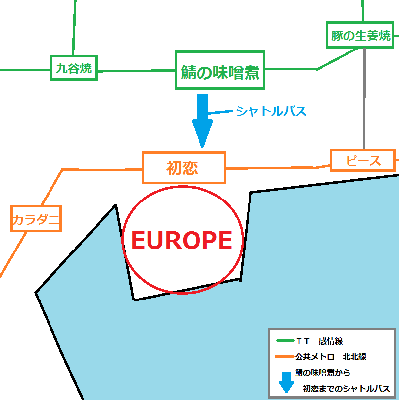
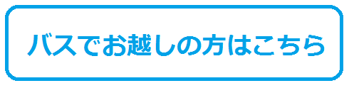

# EUROPE world公式ＨＰへようこそ！！
<
[アトラクションエリア情報へ](https://takajo-soft03.github.io/EUROPE/attraction)>
<
[イベント情報へ](https://takajo-soft03.github.io/EUROPE/event)>  

# EUROPEとは？
EUROPEはまるでＲＰＧの中に飛び込んだかのような気分を味わえる中世ヨーロッパファンタジーテーマパークです。園内は「アトラクションエリア」と「観光エリア」という２つのエリアと、オフィシャルホテルで構成されています。アトラクションで遊ぶ日帰りだけでなく滞在することでも楽しめるつくりとなっています。また、園内すべてのアトラクションやお店が24時間営業となっているので、お好きなタイミングでご利用できます。

# EUROPEの大魔法使いエポルエくん
EUROPEで一番の大魔法使いであるエポルエくんは、様々な魔法を使います。空を飛んだり火を吹いたりと、あの手この手であなたを楽しませようとしてくれます。エポルエくんのパレードやショーなども開催しているので、ご来園の際はぜひご覧下さい。[詳細はこちら](https://takajo-soft03.github.io/EUROPE/event)

# アクセス
EUROPEの最寄り駅、初恋駅までは公共駅から電車で25分。また亀菜空港や海馬空港や主要駅から、直行バスも運行しています。

# 料金表
EUROPEは24時間いつでも入退場可能です。
<table>
  <thead>
    <tr>
      <th>時間</th>
      <th>大人</th>
      <th>子供</th>
    </tr>
  </thead>
  <tbody>
    <tr>
      <th>9:00~21:00</th>
      <th>36,000,000Z＄</th>
      <th>18,000,000Z＄</th>
    </tr>
  </tbody>
  <tbody>
    <tr>
      <th>21:00~9:00</th>
      <th>50,000,000Z＄</th>
      <th>25,000,000Z＄</th>
    </tr>
  </tbody>
</table>

[トップへ戻る](https://takajo-soft03.github.io/EUROPE/)
